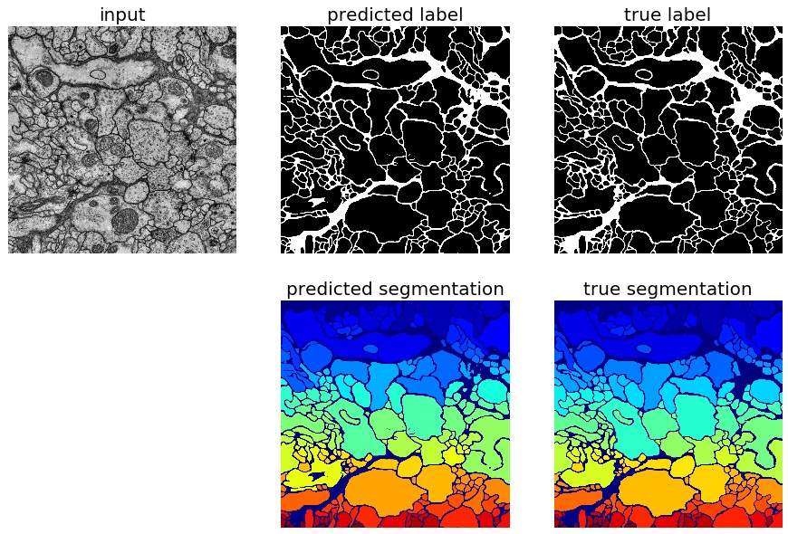

# Dense reconstruction from electron microscope images



### Prerequisites
- Linux or OSX
- Python 2 (full Python 3 will be available soon)
- CPU or NVIDIA GPU + CUDA CuDNN

### Requirements
- Tensorflow 1.0
- Scikit-learn 0.18
- Scikit-image
- Pandas 0.18.2
- Bokeh 12.6

### Preferred
- Anaconda Python distribution
- PyCharm

## Getting Started

- Create environment `heuhaufen` and install requirements, see [instructions](CONDA.md)
- Clone this repository

```bash
git clone https://github.com/tbullmann/heuhaufen.git
```

- Clone other repositories used for computation and visualization if not yet installed

```bash
git clone https://github.com/tbullmann/imagetranslation-tensorflow.git
```

- Symlink repositories

```bash
cd heuhaufen
ln -s ../imagetranslation-tensorflow/ imagetranslation
```

- Create directories

```bash
mkdir datasets  # or symlink; for datasets
mkdir temp  # or symlink; for checkpoints, test results
```

- Download datasets
```bash
bash get-datasets.sh
```

- [Run the examples](examples/README.md)