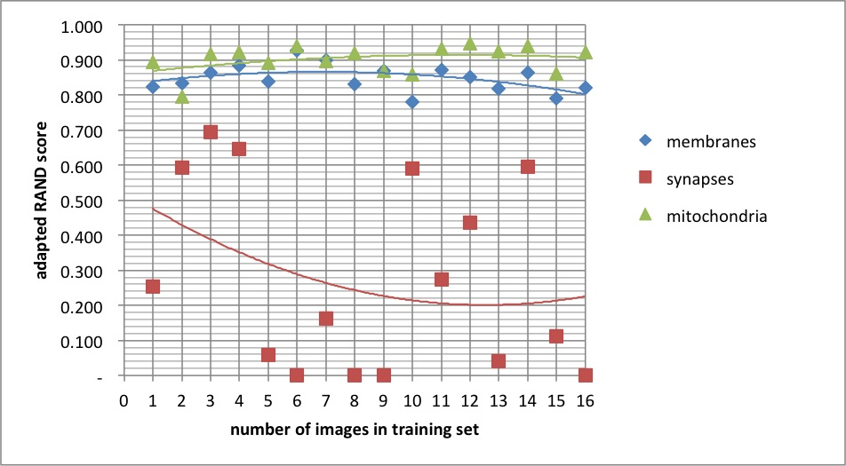

# Dense reconstruction from electron microscope images
## Dependency on the amount of ground truth



A residual net with 9 residual layers (= total 24 layers) was used for the generator, trained using the square los.
The models are trained on 1..16 images, the remaining 19..4 images were used for the test set.
The above diagrams are created from the F-score (=adapted RAND score) for each image, averaged over the test set. The curve represent a fit with a quadratic function.

There is more variability between the runs than due to the size of the training set.

### Reproduce results

Download the VNC dataset (if necessary)

Run the training, test and aggregate the data

```bash
bash publication/amount_ground_truth/test_amount.sh
```

There will be 3 files in the folder `temp/publication/amount_ground_truth/test`: `summary_long.csv`, `summary_wide.scv`, and `averages_wide.csv`.


