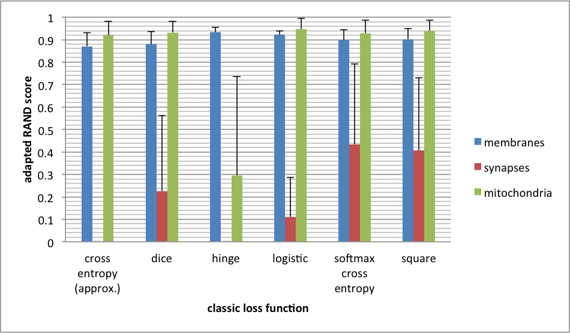

# Dense reconstruction from electron microscope images
## Comparing different classic loss functions



Mean and standard deviation of the adapted RAND score of 4 test images each for 3 models (n=2x4=12). The models are trained on 3 different splits for the train and test sets.

A residual net with 9 residual layers (= total 24 layers) was used for the generator.

All loss functions perform well for the membrane label.
The mitochondria label is also well recognized, except  with the (original pix2pix) hinge loss.
For the synapse label, the best performance is obtained using the square loss and the softmax cross entropy loss. However, the softmax cross entropy is not well justified, because the synapses and membrane label are not mutually exclusive.


### Reproduce results

Download the VNC dataset (if necessary)

Run the training, test and aggregate the data

```bash
bash publication/loss_functions/survery_loss_functions.sh
```

There will be two files in the folder `temp/publication/loss_functions/test`: `summary_long.csv` and `summary_wide.scv`.
The above diagrams are created from the F-score (=adapted RAND score) for each test image. The curves represent a fit with a quadratic function for the number of layers.

### Notes

Loss functions:
- cross entropy (approximated): classic cross entropy, due to [numerical stability issues](https://github.com/Theano/Theano/issues/3162) with values of log(y) with y close to 0, the Taylor series approximation log(y) = (y-1) - (y-1)^2/2 + O(y^3) is used
- dice: loss based on the differentiable [DICE coefficient](https://en.wikipedia.org/wiki/Soerensen-Dice_coefficient)
- hinge: [hinge loss](https://en.wikipedia.org/wiki/Loss_functions_for_classification)
- logistic: [logistic loss](https://en.wikipedia.org/wiki/Loss_functions_for_classification)
- softmax cross entropy: [softmax](https://en.wikipedia.org/wiki/Softmax_function) before [cross entropy](https://en.wikipedia.org/wiki/Loss_functions_for_classification) loss
- square: [square loss](https://en.wikipedia.org/wiki/Loss_functions_for_classification)


