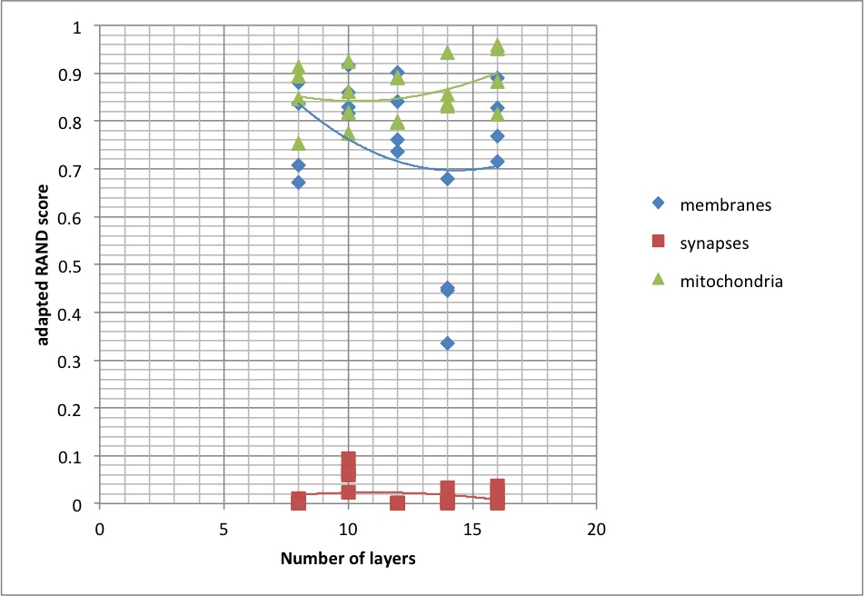
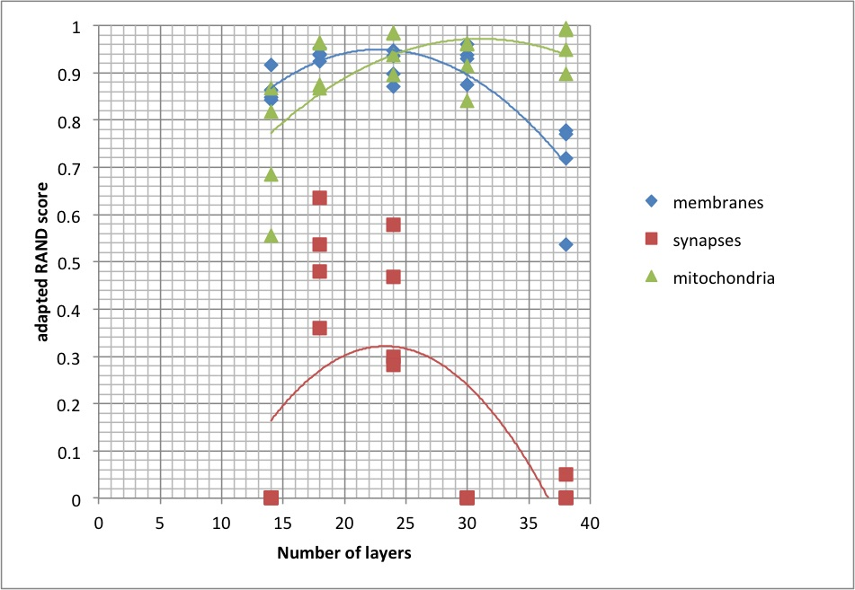
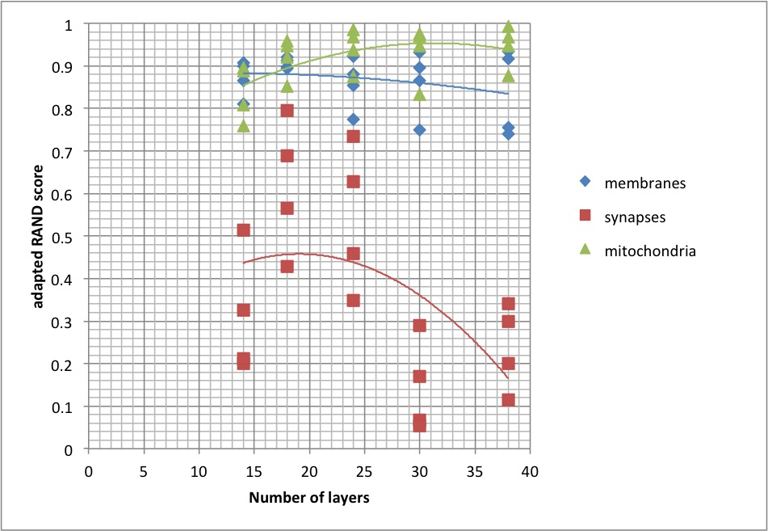
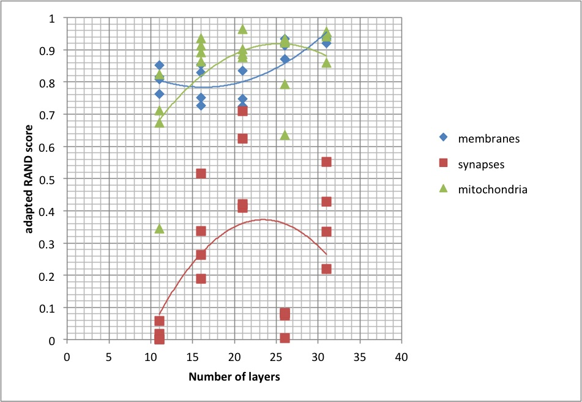

# Dense reconstruction from electron microscope images
## Comparing different generators and depths

|u net|residual net|
|---|---|
|||

|highway net|dense net|
|---|---|
|||


Download the VNC dataset (if necessary)

Run the training and test

```bash
bash publication/how_deep/how_deep.sh
```

Run the interactive visualization

```bash
pyhton publication/how_deep/bokeh_plot.py
```

