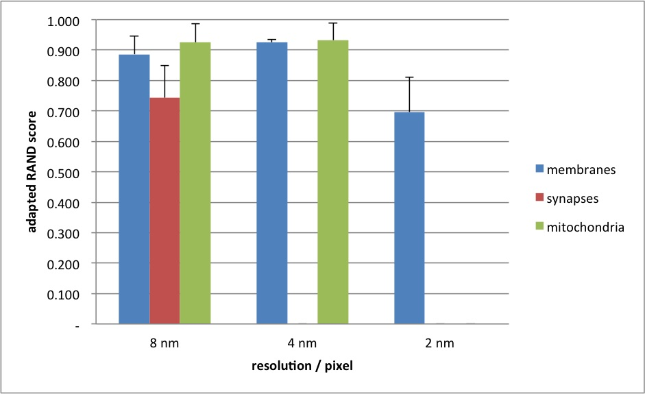
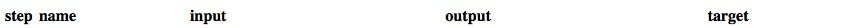
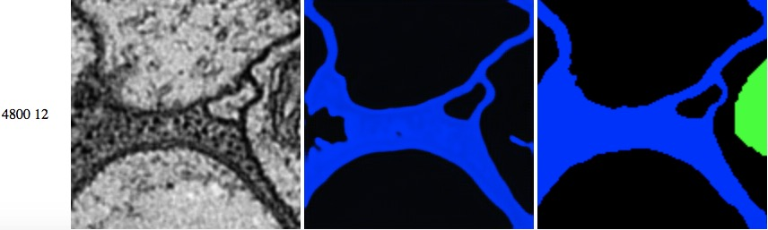
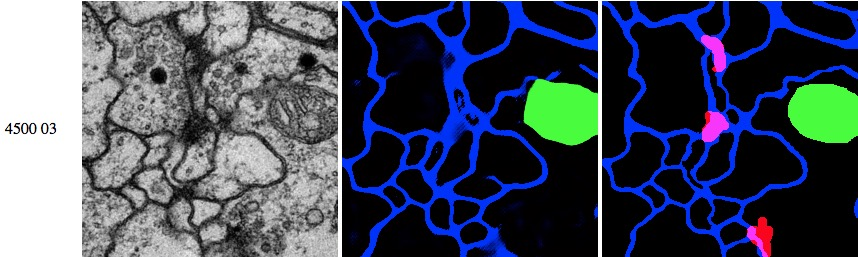
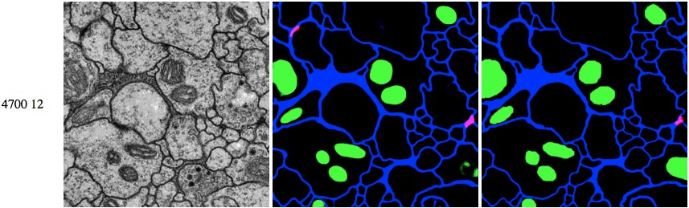

# Dense reconstruction from electron microscope images
## Dependency on scaling/resolution



A residual net with 9 residual layers (= total 24 layers) was used for the generator, trained using the square los.

A lower resolution (8nm/pixel) can drastically improve synapses recognition, compared with the original resolution (4nm/pixel).
Interestingly, a higher resolution (2nm/pixel) can lead to complete failure on learning the synapse and mitochondria labels.
Training of synapse label sometimes fails even on the original resolution.

### Reproduce results

Download the VNC dataset (if necessary)

Run the training, test and aggregate the data

```bash
bash publication/scaling_resolution/test_scaling.sh
```

There will be two files in the folder `temp/publication/scaling/test`: `summary_long.csv` and `summary_wide.scv`.
The above diagrams contain mean and SD for the F-score (=adapted RAND score) for each test image.

### Additional results

|resolution||
|---|---|
|2 nm / pixel||
|4 nm / pixel||
|8 nm / pixel||
